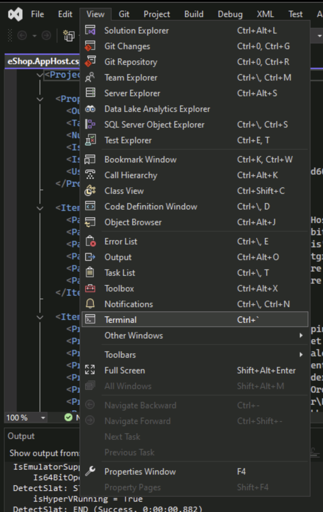
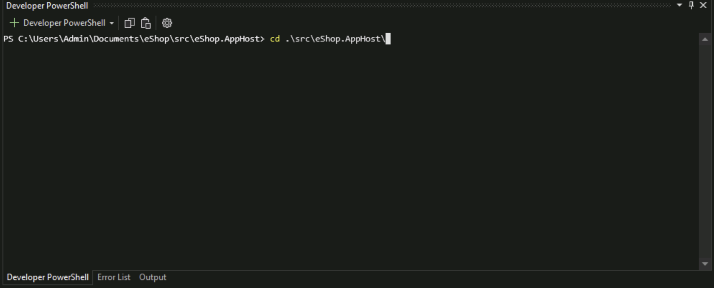
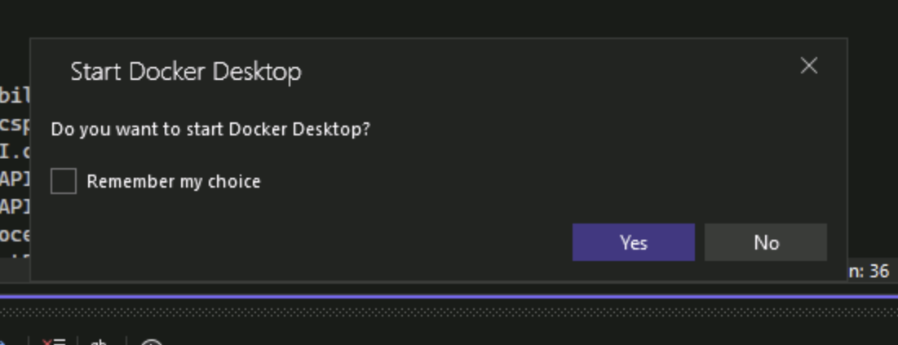
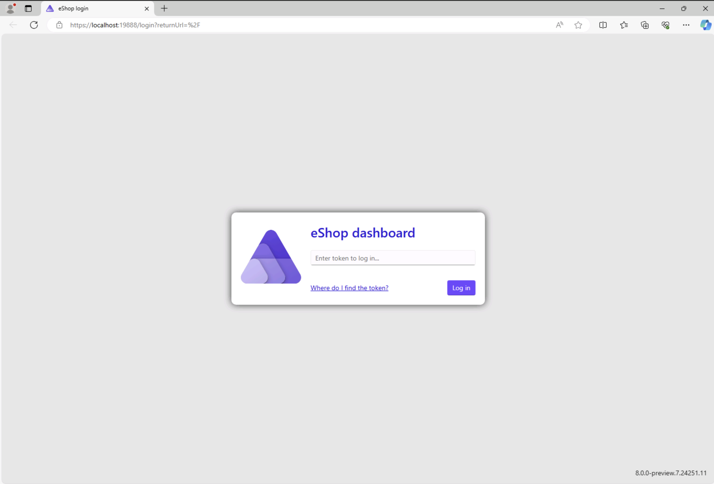
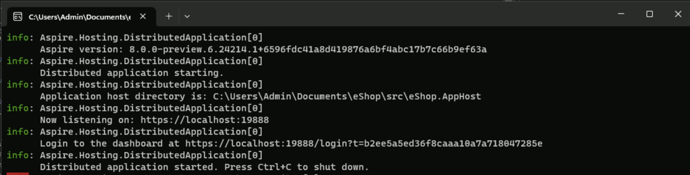

# Learn how to easily integrate AI into your .NET apps

## Welcome

Welcome to Learn how to easily integrate AI into your .NET apps. In this Lab, you are going to learn how to make integrations between a current existing App with Azure AI and AI services. We are thrilled to guide you through the process of enhancing your applications with the power of artificial intelligence, all of this using the incredible [eShop template](https://github.com/dotnet/eshop)!

In this lab, you will:

- Understand how to implement **Azure OpenAI** and **Semantic Kernel** from scratch, gaining a deep understanding of these powerful tools.
- Dive into the **eShop sample code**, exploring its intricacies and learning how to interact with it effectively.
- Discover how to incorporate an **Intelligent Chat feature** into your applications using Aspire and Blazor, enhancing user engagement and experience.

For this workshop, you will need:

- **Azure OpenAI Service**
    - A instance for text generation, featuring  GPT 3.5 or a newer model.
    - A instance to generate our Embeddings, utilizing Text Embedding Ada 002 or a newer model.
- Tooling
    - Visual Studio equipped with .NET 8 and .NET Aspire.
    - Git, for version control and collaborative development.
    - Docker, to manage messaging with RabbitMQ, Redis, PgVector - Version 16 and Postgres.
    - Azure Developer CLI.

Let’s elevate your .NET applications to new heights with Azure AI. We can’t wait to see what you’ll build!

## Services Setup

First, clone this repository!

With the solution open, it’s time to set up your development environment:

- Open the Command Line Interface (CLI): Navigate to `View -> Terminal` or use the shortcut Ctrl + `  to open the integrated terminal within Visual Studio.

- Navigate to the Project Folder: Use the command `cd .\src\eShop.AppHost\` to change directories to the eShop.AppHost folder, where you’ll be running commands to set up the project.

- To integrate Azure AI capabilities into eShop, you’ll need to install the Azure AI hosting support package:

`dotnet add package Aspire.Hosting.Azure.CognitiveServices --version 8.0.0-preview.5.24201.12`

With the package installed, you’ll configure access to your AI resources:
1. **Set Subscription ID**: Replace <subId from Skillable> with your actual Azure subscription ID to set the user secret. `dotnet user-secrets set "Azure:SubscriptionId" <subId from Skillable>` 
1. **Set Resource Group Location**: Replace <RG location from Skillable> with the location of your resource group. `dotnet user-secrets set "Azure:Location" <RG location from Skillable>`
1. **Enable AI**: Use the command `dotnet user-secrets set EnableAI true` to enable AI features in your project.

Finally, it’s time to see eShop in action:

- Press Ctrl + F5 to run the application without debugging.
- If Visual Studio asks you to run Docker, press `Yes` to run the background applications.

!IMAGE[Captura de tela 2024-05-09 114245.png](instructions259607/Captura de tela 2024-05-09 114245.png)

- You are going to get greeted by a Console and a Login screen, follow the instructions to see the dashboard.

- At the dashboard, you will have access to all services and click on the WebApp to see our eShop without the AI features implemented.

Now, let's configure eShop to recieve AI Capabilities. Going to the next step to Configure it to recieve our CatalogAPI.